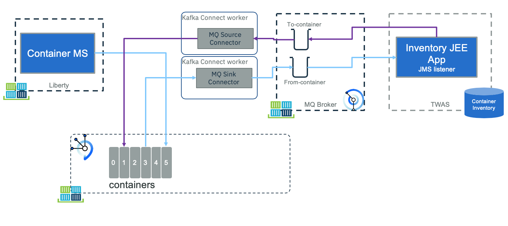
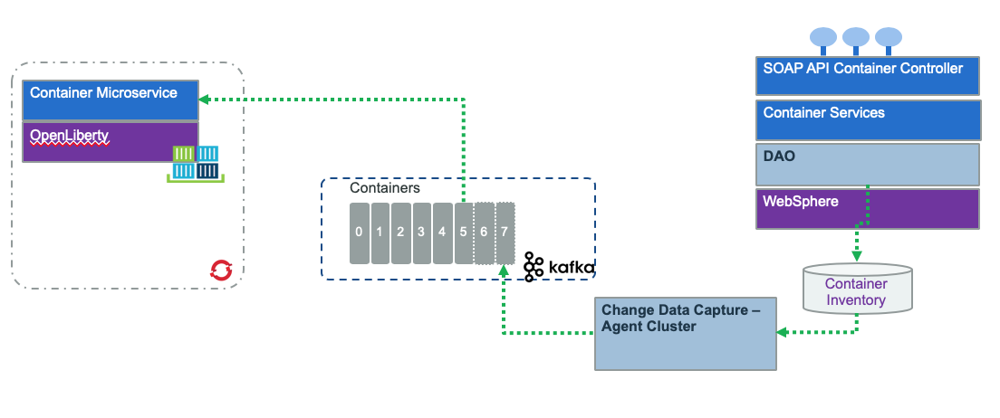

# Container inventory legacy app

This project illustrates the integration of a legacy application with MQ and Kafka. The application manages the current container inventory for the shipment company, introduced in the end to end solution [here.](https://ibm-cloud-architecture.github.io/refarch-kc/)

The JEE application is a 3 tiers architecture, used to manage container inventory. As part of those containers are the Reefer ones. So the approach is to use the legacy application to keep manage the inventory but use MQ or Change Data Capture to propagate the inventory updates to the microservice world. 

## Component views

### MQ integration

The first way to propagate data change is to have the legacy application sharing data via MQ. This is common as MQ is used as messaging services since multiple years:

* On the left of the figure, the container management microservice (implemented in a [separate repository](https://ibm-cloud-architecture.github.io/refarch-kc-container-ms)) supports the Reefer container management and events processing. In the current use case, this component is producing events to a `containers` topic defined in Kafka / Event Streams. One of those events will be container in maintenance and container out of maintenance. It is also interrested to receive new "Reefer added" to the legacy inventory so it can assign order to container. 
* On the right side of the figure, the `Inventory app` is a JEE application managing the container inventory. We did it in Java because we can partially reuse another code from previous contribution. But the most important thing, it is considered as a legacy app, using MQ as communication layer. It could have been done in other language running on mainframe for example. This app is listening to MQ to get container maintenance messages, and publishes container added message to queues.
* The `MQ source connector` is a component that gets messages from the queue, filters messages only about relevant to Reefer container and maps the message as a `containerAdded` event. This code is based on Event Stream MQ connector.
* The `MQ sink connector` is a component to process container events from Kafka `container` topic, filter only the `container on maitenance and off maintenance events` and propagate them to MQ for down stream processing.

### Using Change Data Capture

The second integration is via the deployment of a change data capture solution, like [debezium](https://debezium.io/) 

* The microservice on the left, is listening to events from kafka topics
* The legacy application runs as is, to persist data to a DB server like DB2. 
* The transaction log is monitored by a CDC agent, running in cluster to push data as events to a kafka topic

## Pre-requisites

We assume we have the following pre-installed software:

* [Docker CLI]() and docker engine on your development machine
* For approach 1, MQ running on IBM Cloud, or on IBM Cloud Private, or when running locally using IBM docker image.
* For approach 2, Debezium in docker.
* Maven to compile the JEE application. The JEE app is packaged as war file, and deployed on a OpenLiberty server. It could also have been deployed to WebSphere Application Server. We just used a very simple JEE app.
* IBM Event Stream deployed on public or private cloud, or using Kafka docker images.

## Sub projects

The `jee-inventory` folder includes the Java based project for managing the container inventory. We make it very simple using maven and deployable on WebSphere or on Liberty. 

The `cdc` folder includes the configuration of Debezium and approach 2.

## Build and run

## More readings

* [Developing Java applications for MQ just got easier with Maven](https://developer.ibm.com/messaging/2018/01/09/developing-mq-java-applications-maven/)