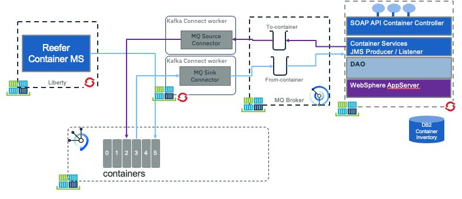

# Container inventory legacy app

This project illustrates how to do data integration from a legacy application to microservice using MQ, Kafka or change data capture and kafka. The application manages the current container inventory for the shipment company, introduced in the end to end solution [here.](https://ibm-cloud-architecture.github.io/refarch-kc/)

The JEE application is a three tier architecture, used to manage container (Dry, FlatRack, OpenTop, OpenSide, Tunnel, Tank, Thermal, Reefer) inventory. The approach is to use the legacy application to keep managing the traditional container inventory but use MQ or Change Data Capture to propagate the inventory updates to the microservice world. 

## Component views

As we propose two types of implementation, you will find in this repository different folder to prepare all the components (folders: `db2`, `jee-inventory` ) and to illustrate the two integrations (`cdc` and  `mq-config`, `kafka-connect` folders).

### MQ integration

The first way to propagate data change is to have the legacy application sharing data via MQ. This is a common approach as MQ is used as messaging services, connecting transactional applications, since multiple years. The solution we want to implement looks in the following figure:




* On the left of the figure, the container management microservice (implemented in a [separate repository](https://ibm-cloud-architecture.github.io/refarch-kc-container-ms)) supports the Reefer container management and the events processing. In the current use case, this component is producing events to a `containers` topic defined in Kafka / Event Streams. One of those events will be container in maintenance and container out of maintenance. The reefer management microservice is interrested to receive new "Reefer added to the legacy inventory" events so it can assign order to those newly added reefers. 
* On the right side of the figure, the `Inventory app` is a JEE application managing the container inventory. We did it in Java because we can partially reuse another code from previous contribution. But the most important thing, it is considered as a legacy app, using MQ as communication layer. It could have been done in other language running on mainframe for example. This app is listening to MQ to get reefer maintenance messages, and publishes container added message to queues.
* The `MQ source connector` is a component that gets messages from the queue, filters messages only relevant to Reefer container and maps the message as a `containerAdded` event. This code is based on Event Stream MQ connector.
* The `MQ sink connector` is a component to process container events from Kafka `container` topic, filter only the `container on maintenance and off maintenance events` and propagate them to MQ for down stream processing.

### Using Change Data Capture

The second integration is via the deployment of a change data capture solution, like [debezium](https://debezium.io/) or [IBM data replication](https://www.ibm.com/cloud/garage/dte/producttour/ibm-infosphere-data-replication-product-tour).


* The microservice on the left, is listening to events from kafka topics, or produce event to kafka. It persists its own data like reefers state and reefer's telemetries.
* The legacy application runs as is, to persist data to a DB server like DB2. 
* The transaction log is monitored by a CDC agent, running in cluster to push data as events to a kafka topic
* As reefer maintenance events have interest in the legacy app, a data transformation agent is added to the solution, to listen to container events and call a SOAP end point to update the state of the container within the legacy inventory.

## Pre-requisites

We assume we have the following pre-installed software:

* Docker CLI and docker engine on your development machine
* For approach 1, MQ running on IBM Cloud, or on IBM Cloud Private, or when running locally using IBM docker image: We are providing a dockerfile and mq configuration to help you on this. See ['Create the MQ image with the queue configuration' section](#create-the-mq-image-with-the-queue-configuration) below.
* Maven to compile the JEE application. The JEE app is packaged as war file, and deployed on a OpenLiberty server. It could also have been deployed to traditional WebSphere Application Server. We just used a very simple JEE app in this solution, as the focus is more on the integration. This application is using JMS to MQ to send and listen to messages.
* IBM Event Stream deployed on public (see [this instruction](https://cloud.ibm.com/docs/services/EventStreams?topic=eventstreams-getting_started#getting_started) for that) or on [private cloud](https://ibm.github.io/event-streams/installing/installing/), or using Kafka docker image to run locally (See our note and scripts with docker-compose in [this repo](https://github.com/ibm-cloud-architecture/refarch-kc/blob/master/docs/deployments/docker.md)).

## Sub projects

The `jee-inventory` folder includes the Java based project for managing the container inventory. We make it very simple using maven and deployable on WebSphere or on Liberty. 

The `db2` includes the scripts and SQL DDL to create the database for the inventory and a docker image for running DB2 locally.

The `cdc` folder includes the configuration of Debezium and approach 2.

The `mq-config` includes the MQ configuration and docker file to run MQ locally.

## Build and run

See [this separate note.](run-local.md)

## Integration tests

The folder `scripts` includes a simple add container scripts to post a new container to the web application.

To create a Reefer with id C200 use:
```
./addContainer.sh C200
```

To validate the record is added to the database

```
curl http://localhost:9080/containers/C200
```

We should have enought to test CDC with Debezium.

## More readings

* [Developing Java applications for MQ just got easier with Maven](https://developer.ibm.com/messaging/2018/01/09/developing-mq-java-applications-maven/)
* [IBM InfoSphere Data Replication Product Tour](https://www.ibm.com/cloud/garage/dte/producttour/ibm-infosphere-data-replication-product-tour)
* [Integrating IBM CDC Replication Engine with kafka](https://www.ibm.com/support/knowledgecenter/en/SSTRGZ_11.4.0/com.ibm.cdcdoc.cdckafka.doc/concepts/before_install.html)