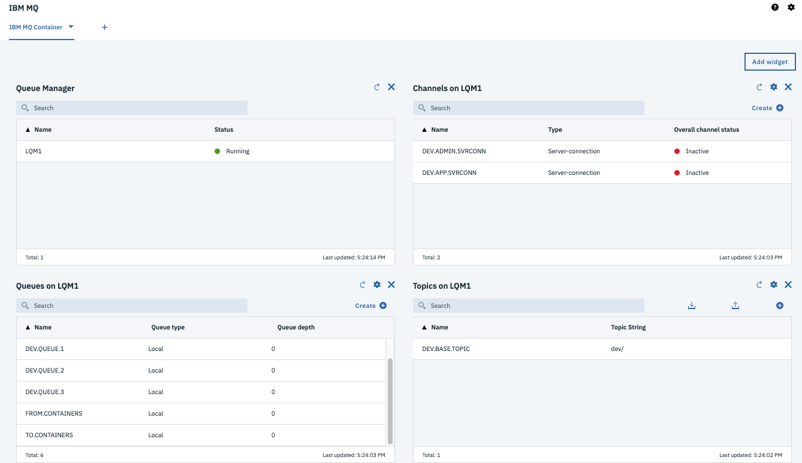

# Run the solution locally

This is for development by running Db2 in docker on your laptop.


Run the Liberty server locally with DB2 and MQ in docker containers.

## Pre-requisites

* Get docker and docker cli for your local environment
* Get docker compose 


## Creating the INVDB in DB2

!!! note
        The creation of the INVDB database with the containers table and some test data should be done only the first time, or each time you delete the `db2/database` folder.

Go to the `db2` folder and start the db2 server with the script:

```shell
./startDB2.sh

# which is the same as running the ibmcom/db2 community edition
docker run -it --name db2 --privileged=true -p 50000:50000 -e LICENSE=accept -e DB2INST1_PASSWORD=db2inst1 -e DBNAME=INVDB -v $(pwd):/home -v $(pwd)/database:/database ibmcom/db2
```

This will download a development docker image for DB2 and configure the INVDB database. The container table needs to be added using the following steps within the docker shell:

* Start the bash session within the db2 server
    
```
docker exec -ti db2 bash
```

* Then swap to `db2inst1` user and use the scripts that were mounted under /home

```
su - db2inst1
cd /home/sql/inventory
./createDB.sh
```

    The trace should look like:

    ```
    INVDB

     Database Connection Information ...

    Containers table not found so let create it
    create table containers ( containerid VARCHAR(30) NOT NULL, type VARCHAR(20), status VARCHAR(20), brand VARCHAR(50), capacity DECIMAL, CREATIONDATE TIMESTAMP, UPDATEDATE TIMESTAMP, PRIMARY KEY (containerid) )
    DB20000I  The SQL command completed successfully.
    There is no data in inventory DB, let add some...
    INSERT INTO containers (containerid, type, status, brand, capacity) 
    
    VALUES ('C01','Reefer','Operational','containerbrand',20), 
    ('C02','Dry','Operational','containerbrand',20), 
    ('C03','Dry','Operational','containerbrand',40), ('C04','FlatRack','Operational','containerbrand',40), 
    ('C05','OpenTop','Operational','containerbrand',40),
    ('C06','OpenSide','Operational','containerbrand',40), 
    ('C07','Tunnel','Operational','containerbrand',40), 
    ('C08','Tank','Operational','containerbrand',40), 
    ('C09','Thermal','Operational','containerbrand',20)

    DB20000I  The SQL command completed successfully.
    ```

* Exit the shell sessions. The database is created under the db2 folder, and it is git ignored.

* Stop DB2 docker instance with `docker stop db2`
* Tag the image of the container so we can reuse the same database.

```
ID=$(docker ps -l|grep db2|awk '{print $1}') 
docker commit --author="IBMCASE" $ID ibmcase/greendb2
```

This docker image will be used in the docker compose settings to run the solution locally. Also the `ibncase/greendb2` is available in public docker hub.

## Create the MQ image with the queue configuration

!!! Note
        Queue manager and queue data are saved in the filesystem. To avoid losing the queue manager and queue data, we use docker volumes. Volumes are attached to containers when they are run and persist after the container is deleted. The following command creates a volume name `qm1data`

Work under the `mq-config` folder.

```shell
cd mq-config
docker volume create qm1data
```

The remote MQ clients use a `Channel` to communicate with the MQ manager over the network. We need to create a virtual docker network to support this communication. The command below creates such network:

```shell
docker network create mq-network
``` 

The folder mq-config includes the `20-config.mqsc` file to define the queues to be used to communicate with Kafka.

```
define ql('TO.CONTAINERS')
define ql('FROM.CONTAINERS')
```

The goal is to take the IBM MQ development image and move this configuration file inside the image.

```
docker build -t ibmcase/mq .
```

For more information of the IBM MQ image see [this note](https://hub.docker.com/r/ibmcom/mq/) and [how to use the MQ container](https://github.com/ibm-messaging/mq-container/blob/master/docs/usage.md).


The scripts `runMQlocal.sh` uses docker and the IBM MQ docker image to run MQ as a daemon. This is helpful when developing the JMS consumer and producer code, but we recommend to use the docker-compose to start both MQ and DB2.

Going to the console: [https://localhost:9443/ibmmq/console/login.html](https://localhost:9443/ibmmq/console/login.html) to login using the admin user. See instructions [in this note](https://github.com/ibm-messaging/mq-container/blob/master/docs/developer-config.md).




## Build the jee-inventory webapp

```
mvn package -DskipIT
```

This will build the containerinventory.war file and prepare Liberty defaultServer without running the Integration tests. 

## Start the webapp with maven

To start the web app

```
mvn liberty:run
```

Point the browser to the following address:

* Verify the app is up and running [http://localhost:9080/health](http://localhost:9080/health)
* Get the list of all containers: [http://localhost:9080/containers](http://localhost:9080/containers)
* Get a container using its ID: `http://localhost:9080/containers/C02`
* Get the private api `https://localhost:9443/ibm/api` use the admin user and password as defined in the `src/main/liberty/config/server.xml` file.


## Start the solution using docker compose

Under the project folder, use the following command to start both DB2 and MQ

```
docker-compose up
```

The docker-compose.yml file defines the two services, one volume for MQ and the mq network.